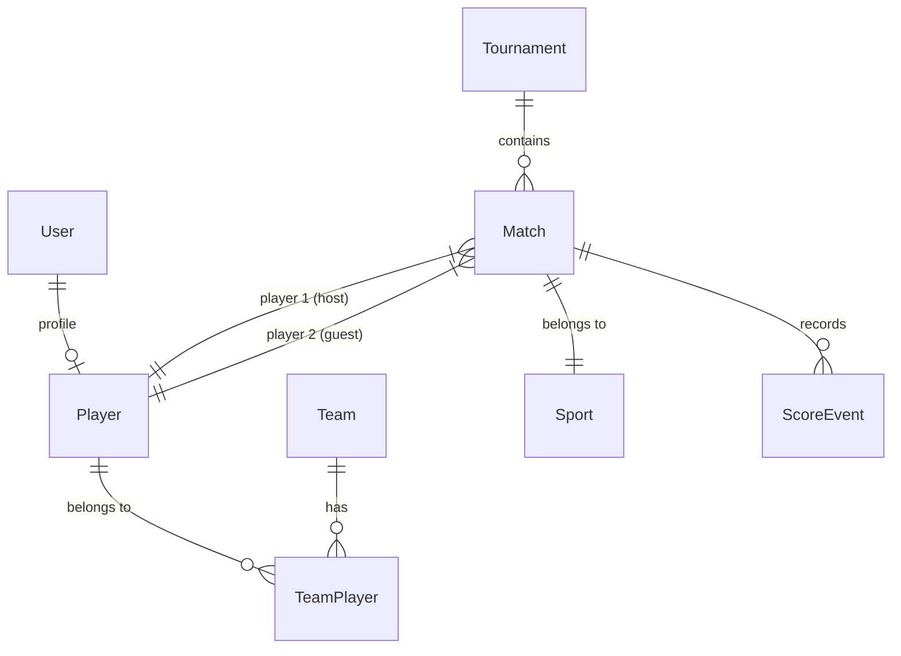

# Sport Heroes - Backend Architecture & Implementation Steps

This document outlines the architectural decisions, design patterns, database schema, and development phases for the **Sport Heroes** sports data platform.

---

## 1. Architectural Philosophy

Following industry best practices for startup scale-up (as highlighted in the project blueprint), the backend is designed as a **Modular Monolith** using **Express** and **TypeScript**. 

### Why Modular Monolith?
- **Ease of Development:** A single repository simplifies codebase search, sharing, testing, and deployment.
- **Clear Boundaries:** Modules are organized by functional domain (e.g., `auth`, `players`, `matches`, `scoring`, `statistics`). Each domain maintains clear boundaries and communicates via well-defined interfaces.
- **Easy Transition to Microservices:** When scaling limits are reached, individual folders/modules can easily be extracted into standalone microservices behind an API Gateway.

```
                    ┌─────────────────┐
                    │   Client App    │
                    └────────┬────────┘
                             │
                             ▼
                    ┌─────────────────┐
                    │   Express App   │
                    └────────┬────────┘
                             │
       ┌─────────────┼─────────────┼─────────────┐
       ▼             ▼             ▼             ▼
┌────────────┐┌────────────┐┌────────────┐┌────────────┐
│    Auth    ││  Players   ││  Matches   ││  Scoring   │  ... (Modules)
└────────────┘└────────────┘└────────────┘└────────────┘
```

---

## 2. Event-Driven Scoring Engine

The scoring engine implements **Event-Driven Scoring** rather than direct score modification.

### Core Concept
Instead of mutating the score directly (e.g., `score = score + 1`), the system:
1. Receives an action (e.g., "Player A wins a point on serve").
2. Generates an immutable **ScoreEvent**.
3. Appends the event to a database table (`ScoreEvent`).
4. Re-computes or updates the match state by running the match's event stream against the sport configuration rules.

### Advantages
- **Undo / Redo Support:** Restoring a match state after an incorrect score call is as simple as deleting/canceling the last event and re-evaluating the event stream.
- **Replays & Timelines:** Renders a clean chronological feed of how the match progressed.
- **Audit Trails:** Provides data verification in competitive matches to prevent scoring fraud.
- **Rich Analytics:** Event logs store granular metadata (e.g., service aces, errors) which feeds the Statistics & Analytics Engines.

---

## 3. Dynamic Sport Configuration (Table Tennis)

To prevent hardcoding rules for different sports (e.g., `if (sport == 'badminton')`), the system utilizes a **configurable rules engine**. 

### Schema of Sport Rules
Every sport is defined by a `SportConfig` structure:
- **Winning Score:** Points needed to win a set (e.g., 11 for Table Tennis, 21 for Badminton).
- **Difference Rule:** Minimum point difference to win a set (e.g., must win by 2 points).
- **Match Format:** Best of $N$ sets (e.g., best of 5 sets for Table Tennis).
- **Event Types:** Allowed events for that sport (e.g., `point_won`, `ace`, `serve_error`, etc.).

### Table Tennis Configuration
```typescript
export const TableTennisConfig: SportConfig = {
  name: 'Table Tennis',
  key: 'table_tennis',
  scoringRules: {
    pointsToWinSet: 11,
    differenceToWinSet: 2,
    bestOfSets: 5,
  },
  eventTypes: ['point_won', 'ace', 'serve_error', 'receive_error', 'rally_won', 'error']
};
```

---

## 4. Entity Relationship Diagram (ERD)

The database schema (PostgreSQL) is relational. The entity model structure:



### High-Level PostgreSQL Tables
1. **User:** Core auth account (id, email, password_hash, role, created_at).
2. **Player:** Player profiles linked to users (id, userId, firstName, lastName, avatarUrl, rating).
3. **Team:** Team profiles for doubles or league matches (id, name, captainId).
4. **Sport:** Sport metadata & static rule configurations (id, key, name, ruleJson).
5. **Match:** Match instance details (id, sportKey, player1Id, player2Id, status, currentSet, winnerId).
6. **ScoreEvent:** Event stream logs (id, matchId, playerId, eventType, timestamp, value).

---

## 5. Implementation Roadmap

The project is split into 6 phased steps to establish the MVP and grow the product iteratively:

### Phase 1: Foundation (Current Phase)
- [x] Initial Express and TypeScript skeleton.
- [x] PostgreSQL connection pool setup.
- [x] Application structure setup (`modules`, `config`, `database`).
- [x] Basic in-memory Table Tennis config and scoring engine proof-of-concept.

### Phase 2: Live Match Engine (Next)
- [ ] Migrate PostgreSQL schema migrations (Users, Players, Matches, ScoreEvents).
- [ ] Integrate a transactional Database Repository to persist matches and score events.
- [ ] Setup WebSocket (Socket.io) server to broadcast live score changes to viewers.
- [ ] Add Redis caching layer for quick lookup of active live score cards.

### Phase 3: Player Statistics Engine
- [ ] Add endpoints to query match history.
- [ ] Build background event-processor/worker to aggregate stats (aces, errors, win/loss ratios) from the event streams.
- [ ] Implement an Elo-based ranking formula that updates player rankings on match completion.

### Phase 4: Tournament Management
- [ ] Add Tournament scheduling routes.
- [ ] Support Bracket generation algorithms (Single Elimination, Double Elimination, Round Robin).
- [ ] Establish match schedules and standings/tables updates.

### Phase 5: Social Features
- [ ] Implement user follow/unfollow system.
- [ ] Setup Firebase Cloud Messaging (FCM) to push live match notifications to followers.
- [ ] Shareable match summary report generator.

### Phase 6: Scale + AI
- [ ] Migrate Elasticsearch for global player/match searching.
- [ ] File storage uploads for certificates, profile photos, and match video clips using Cloudflare R2 / AWS S3.
- [ ] Automated game insights using ML (e.g. identify scoring trends, streaks, and performance projections).
